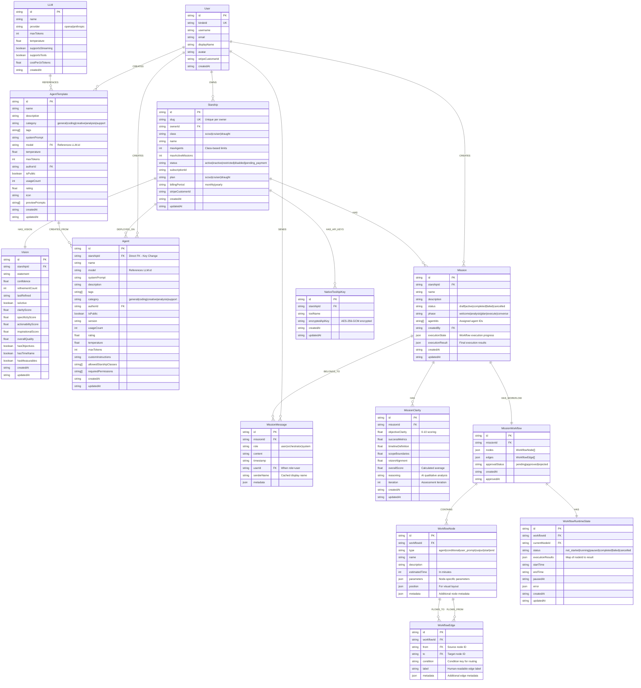
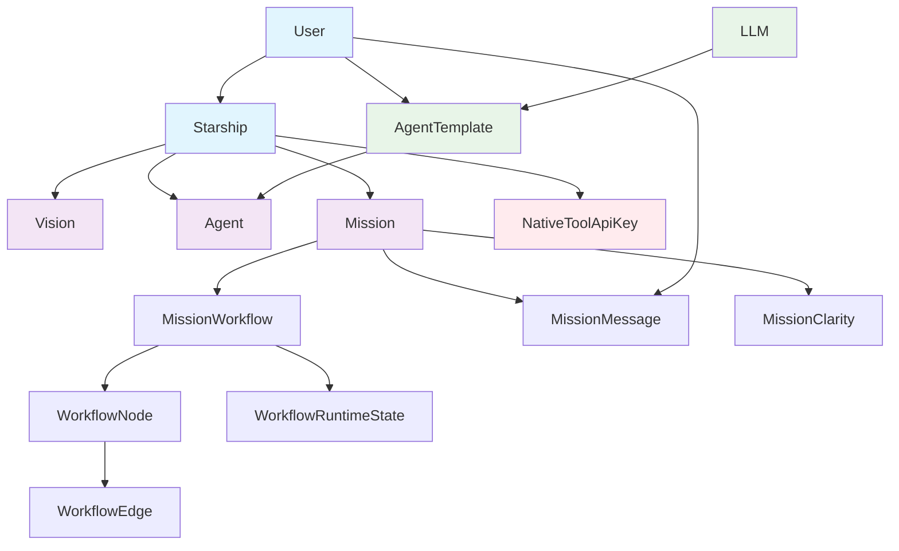

# Starships.ai Entity Relationship Diagram

## Comprehensive Data Model

```mermaid
erDiagram
    %% Core User and Starship System
    User {
        string id PK
        string kindeId UK
        string username
        string email
        string displayName
        string avatar
        string stripeCustomerId
        string createdAt
    }

    Starship {
        string id PK
        string slug UK "Unique per owner"
        string ownerId FK
        string class "scout|cruiser|draught"
        string name
        int maxAgents "Class-based limits"
        int maxActiveMissions
        string status "active|inactive|restricted|disabled|pending_payment"
        string subscriptionId
        string plan "scout|cruiser|draught"
        string billingPeriod "monthly|yearly"
        string stripeCustomerId
        string createdAt
        string updatedAt
    }

    Vision {
        string id PK
        string starshipId FK
        string statement
        float confidence
        int refinementCount
        string lastRefined
        boolean isActive
        float clarityScore
        float specificityScore
        float actionabilityScore
        float inspirationalScore
        float overallQuality
        boolean hasObjectives
        boolean hasTimeframe
        boolean hasMeasurables
        string createdAt
        string updatedAt
    }

    %% AI Agent System
    LLM {
        string id PK
        string name
        string provider "openai|anthropic"
        int maxTokens
        float temperature
        boolean supportsStreaming
        boolean supportsTools
        float costPer1kTokens
        string createdAt
    }

    AgentTemplate {
        string id PK
        string name
        string description
        string category "general|coding|creative|analysis|support"
        string[] tags
        string systemPrompt
        string model FK "References LLM.id"
        float temperature
        int maxTokens
        string authorId FK
        boolean isPublic
        int usageCount
        float rating
        string icon
        string[] previewPrompts
        string createdAt
        string updatedAt
    }

    Agent {
        string id PK
        string starshipId FK "Direct FK - Key Change"
        string name
        string model "References LLM.id"
        string systemPrompt
        string description
        string[] tags
        string category "general|coding|creative|analysis|support"
        string authorId FK
        boolean isPublic
        string version
        int usageCount
        float rating
        float temperature
        int maxTokens
        string customInstructions
        string[] allowedStarshipClasses
        string[] requiredPermissions
        string createdAt
        string updatedAt
    }

    %% Mission System
    Mission {
        string id PK
        string starshipId FK
        string name
        string description
        string status "draft|active|completed|failed|cancelled"
        string phase "welcome|analysis|plan|execute|converse"
        string[] agentIds "Assigned agent IDs"
        string createdBy FK
        json executionState "Workflow execution progress"
        json executionResult "Final execution results"
        string createdAt
        string updatedAt
    }

    MissionMessage {
        string id PK
        string missionId FK
        string role "user|orchestrator|system"
        string content
        string timestamp
        string userId FK "When role=user"
        string senderName "Cached display name"
        json metadata
    }

    MissionClarity {
        string id PK
        string missionId FK
        float objectiveClarity "0-10 scoring"
        float successMetrics
        float timelineDefinition
        float scopeBoundaries
        float visionAlignment
        float overallScore "Calculated average"
        string reasoning "AI qualitative analysis"
        int iteration "Assessment iteration"
        string createdAt
        string updatedAt
    }

    %% Workflow System
    MissionWorkflow {
        string id PK
        string missionId FK
        json nodes "WorkflowNode[]"
        json edges "WorkflowEdge[]"
        string approvalStatus "pending|approved|rejected"
        string createdAt
        string approvedAt
    }

    WorkflowNode {
        string id PK
        string workflowId FK
        string type "agent|conditional|user_prompt|output|start|end"
        string name
        string description
        int estimatedTime "In minutes"
        json parameters "Node-specific parameters"
        json position "For visual layout"
        json metadata "Additional node metadata"
    }

    WorkflowEdge {
        string id PK
        string workflowId FK
        string from FK "Source node ID"
        string to FK "Target node ID"
        string condition "Condition key for routing"
        string label "Human-readable edge label"
        json metadata "Additional edge metadata"
    }

    WorkflowRuntimeState {
        string id PK
        string workflowId FK
        string currentNodeId FK
        string status "not_started|running|paused|completed|failed|cancelled"
        json executionResults "Map of nodeId to result"
        string startTime
        string endTime
        string pausedAt
        json error
        string createdAt
        string updatedAt
    }

    %% Security and API Management
    NativeToolApiKey {
        string id PK
        string starshipId FK
        string toolName
        string encryptedApiKey "AES-256-GCM encrypted"
        string createdAt
        string updatedAt
    }


    %% Primary Relationships
    User ||--o{ Starship : "OWNS"
    User ||--o{ Agent : "CREATES"
    User ||--o{ AgentTemplate : "CREATES"
    User ||--o{ Mission : "CREATES"
    User ||--o{ MissionMessage : "SENDS"

    %% Starship Relationships
    Starship ||--|| Vision : "HAS_VISION"
    Starship ||--o{ Agent : "DEPLOYED_ON"
    Starship ||--o{ Mission : "HAS"
    Starship ||--o{ NativeToolApiKey : "HAS_API_KEYS"

    %% Agent System Relationships
    LLM ||--o{ AgentTemplate : "REFERENCES"
    AgentTemplate ||--o{ Agent : "CREATES_FROM"

    %% Mission Relationships
    Mission ||--|| MissionWorkflow : "HAS_WORKFLOW"
    Mission ||--o{ MissionMessage : "BELONGS_TO"
    Mission ||--o{ MissionClarity : "HAS"

    %% Workflow Relationships
    MissionWorkflow ||--o{ WorkflowNode : "CONTAINS"
    MissionWorkflow ||--|| WorkflowRuntimeState : "HAS"
    WorkflowNode ||--o{ WorkflowEdge : "FLOWS_FROM"
    WorkflowNode ||--o{ WorkflowEdge : "FLOWS_TO"

```

## Concise Core Domain Model

```mermaid
graph TD
    %% Core Entities
    U[User] --> S[Starship]
    S --> V[Vision]
    S --> A[Agent]
    S --> M[Mission]
    S --> NK[NativeToolApiKey]

    %% Agent System
    U --> AT[AgentTemplate]
    AT --> A
    L[LLM] --> AT

    %% Mission System
    M --> MW[MissionWorkflow]
    MW --> WN[WorkflowNode]
    WN --> WE[WorkflowEdge]
    MW --> WRS[WorkflowRuntimeState]
    M --> MM[MissionMessage]
    M --> MC[MissionClarity]
    U --> MM


    %% Styling
    classDef primary fill:#e1f5fe
    classDef secondary fill:#f3e5f5
    classDef system fill:#e8f5e8
    classDef security fill:#ffebee

    class U,S primary
    class A,M,V secondary
    class L,AT system
    class NK security
```